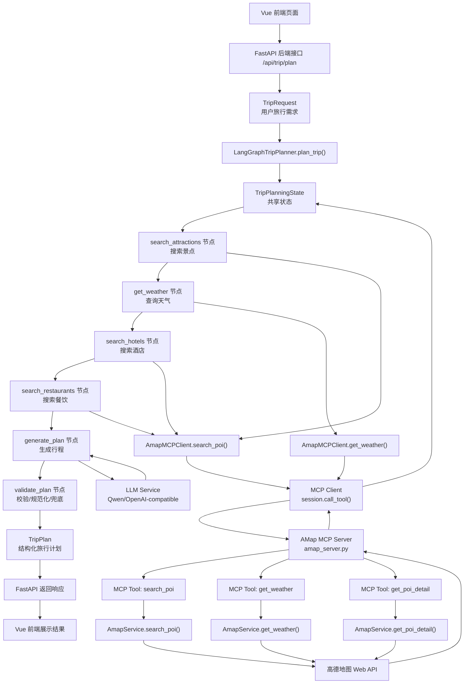

# HelloAgents Trip Planner 项目总结

本文总结当前项目的 Agent + MCP 架构、核心调用链、数据流和学习重点。

## 1. 项目定位

当前项目是一个工具增强型旅行规划 Agent。

它不是 RAG Agent,也没有长期记忆系统。它的核心能力是:

```text
前端收集旅行需求
后端用 FastAPI 接收请求
LangGraph 编排 Agent 工作流
MCP 封装高德地图工具
高德 API 提供真实地点和天气数据
LLM 基于结构化数据生成旅行计划
后端校验并返回 TripPlan
前端展示结果
```

一句话概括:

```text
前端提交 TripRequest,FastAPI 调用 LangGraph Agent;Agent 通过 MCP 调用高德工具获取真实数据,再调用 LLM 生成 TripPlan,最后校验兜底并返回给前端展示。
```

## 2. 完整架构图



## 3. Agent 主流程

用户提交请求后,后端会构造一个 `TripRequest`。

Agent 的入口是:

```text
LangGraphTripPlanner.plan_trip(request)
```

初始 State 只有:

```python
{
    "request": request,
    "errors": []
}
```

原因是:

```text
request 是用户任务本身;
errors 用于记录执行过程中的可恢复错误;
景点、酒店、餐饮、天气、plan 都是后续节点逐步生成的。
```

LangGraph 工作流顺序是:

```text
search_attractions
 -> get_weather
 -> search_hotels
 -> search_restaurants
 -> generate_plan
 -> validate_plan
 -> END
```

每个节点都遵循同一个模式:

```text
从 State 读取上下文
 -> 调用工具或 LLM
 -> 得到结构化结果
 -> 写回 State
```

## 4. MCP 调用链

当前项目属于自己构建 MCP 服务,不是使用现成 MCP 服务。

自建 MCP Server 文件:

```text
backend/app/mcp_servers/amap_server.py
```

自建 MCP Client 文件:

```text
backend/app/services/mcp_amap_client.py
```

底层真实数据来自现有高德地图 Web API:

```text
自建 MCP Server
 -> AmapService
 -> 高德地图 Web API
```

以搜索景点为例,调用链是:

```text
search_attractions 节点
 -> self._search_poi("景点", city, limit=12)
 -> AmapMCPClient.search_poi(...)
 -> _call_tool("search_poi", arguments)
 -> session.call_tool("search_poi", arguments)
 -> AMap MCP Server 的 @mcp.tool search_poi
 -> AmapService.search_poi(...)
 -> 高德地图 API
```

如果 MCP 调用失败,Agent 会回退到本地 `AmapService`:

```text
MCP 调用失败
 -> 记录 last_error
 -> Agent 打印 warning
 -> 回退到 self.amap_service.search_poi() 或 get_weather()
```

所以 MCP 的加入不会破坏原有可用性。

## 5. MCP Server 的作用

`amap_server.py` 负责把普通 Python 函数注册成 MCP 工具。

核心形式是:

```python
mcp = FastMCP("helloagents-amap")

@mcp.tool()
def search_poi(...):
    ...
```

当前暴露了三个工具:

```text
search_poi: 搜索 POI,用于景点、酒店、餐饮搜索
get_weather: 查询城市天气
get_poi_detail: 查询 POI 详情和图片等信息
```

它们内部并不直接手写 HTTP 请求,而是复用:

```text
backend/app/services/amap_service.py
```

这样设计的好处是:

```text
MCP Server 只负责工具协议暴露;
AmapService 负责高德 API 请求与解析;
Agent 不关心底层 HTTP 细节。
```

## 6. MCP Client 的作用

`mcp_amap_client.py` 负责让 Agent 像调用普通 Python 方法一样调用 MCP 工具。

Agent 里看到的是:

```python
self.amap_mcp.search_poi(...)
self.amap_mcp.get_weather(...)
```

Client 内部实际做的是:

```text
普通 Python 参数
 -> arguments dict
 -> MCP session.call_tool()
 -> MCP Server 工具
 -> JSON 文本结果
 -> json.loads()
 -> Pydantic 对象
```

以 `search_poi` 为例:

```python
result = self._call_tool(
    "search_poi",
    {
        "keywords": keywords,
        "city": city,
        "citylimit": citylimit,
        "limit": limit,
    },
)
```

返回后再转成:

```python
List[POIInfo]
```

关键代码:

```python
return [POIInfo.model_validate(item) for item in result]
```

## 7. 数据形式转换

以 `search_poi` 为例,每一层的数据形式如下:

```text
Agent:
Python 参数
  ↓
MCP Client:
dict arguments
  ↓
MCP 协议:
tools/call 消息
  ↓
MCP Server:
Python 函数参数
  ↓
AmapService:
HTTP query params
  ↓
高德 API:
原始 JSON
  ↓
AmapService:
List[POIInfo]
  ↓
MCP Server:
List[dict]
  ↓
MCP Server 返回:
JSON 字符串
  ↓
MCP Client:
list/dict
  ↓
MCP Client:
List[POIInfo]
  ↓
Agent:
List[POIInfo]
```

为什么要这样转换?

```text
对外用 JSON;
对内用 Pydantic 对象;
跨 MCP 协议时再转成 JSON 文本。
```

原因是:

```text
高德 API 只能返回 HTTP JSON;
Agent 内部更适合使用 POIInfo、WeatherInfo 等对象;
MCP Server 和 MCP Client 跨进程通信,不能直接传 Python 对象;
JSON 是更通用、更稳定的传输格式。
```

## 8. 核心数据模型

主要模型都在:

```text
backend/app/models/schemas.py
```

重点理解三类:

```text
TripRequest:
用户输入,是 Agent 要解决的任务。

TripPlanningState:
单次工作流的临时共享状态。

TripPlan:
最终输出,也是前端展示的结构化旅行计划。
```

过程数据包括:

```text
POIInfo:
高德 POI 的通用内部表示。

Attraction:
景点业务模型。

Hotel:
酒店业务模型。

Meal:
餐饮业务模型。

WeatherInfo:
天气上下文。

Budget:
预算结构。
```

关系是:

```text
高德原始 JSON
 -> POIInfo
 -> Attraction / Hotel / Meal
 -> TripPlan.days
```

## 9. LLM 调用链

当前项目调用的是 OpenAI-compatible LLM,可以接 Qwen 或 OpenAI 兼容接口。

LLM 调用发生在:

```text
_generate_plan_node
```

调用前会构造:

```text
系统 prompt
目标 schema
输入数据 payload
```

然后要求 LLM 输出 JSON:

```text
LLM 返回 JSON
 -> TripPlan(**data)
 -> 写入 State["plan"]
```

为什么要求 JSON?

```text
因为后端要把 LLM 输出稳定转换成 TripPlan;
前端展示依赖结构化字段;
自然语言回答不适合程序继续处理。
```

这属于:

```text
Structured Output
结构化输出
```

## 10. 校验与兜底

`validate_plan` 节点负责最后检查。

它会检查:

```text
plan 是否是 TripPlan 对象
plan.days 数量是否等于 request.travel_days
日期、城市、交通、住宿等字段是否需要 normalize
```

如果校验失败:

```text
记录 errors
 -> 使用 _create_rule_based_plan(state)
 -> 返回备用 TripPlan
```

这体现了 Agent 工程里的关键思想:

```text
LLM 负责生成复杂内容;
代码负责校验关键约束;
失败时必须有 fallback。
```

## 11. 当前不包含的能力

当前项目没有真正的长期记忆系统。

`TripPlanningState` 只是单次工作流内的临时状态,请求结束后不会长期保存用户偏好。

当前项目也不是 RAG 系统。

它没有:

```text
embedding
向量库
文档切分
知识库检索
retriever
```

它更适合定位为:

```text
工具增强型 Agent
```

也就是:

```text
LLM + LangGraph + MCP 工具 + 外部实时 API + 结构化输出
```

## 12. 学习重点总结

这个项目最值得掌握的是:

```text
1. TripRequest 如何定义用户任务
2. TripPlanningState 如何作为单次工作流状态
3. LangGraph 如何编排节点
4. 每个节点如何读 State、调工具、写 State
5. MCP Server 如何暴露工具
6. MCP Client 如何调用工具
7. 高德 API 数据如何进入 Agent
8. LLM 如何生成结构化 TripPlan
9. validate 节点如何校验与 fallback
10. 前后端如何通过固定 schema 对接
```

最终记忆版:

```text
这个项目 = FastAPI + LangGraph + MCP + 高德 API + LLM + Vue。

FastAPI 负责接口;
LangGraph 负责 Agent 工作流;
MCP 负责工具协议层;
高德 API 负责真实数据;
LLM 负责生成旅行计划;
Pydantic schema 负责输入输出约束;
Vue 负责展示结果。
```
